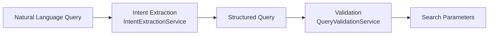

# Architecture

## Pipeline



### ASCII fallback

```
Natural Language Query
        |
        v
Intent Extraction  (category, color, brand, price range, use case —
                     each independently matched against a dictionary or regex)
        |
        v
Structured Query  (only fields with evidence in the query are non-null)
        |
        v
Validation  (internal consistency checks — e.g. minPrice > maxPrice)
        |
        v
Search Parameters  (the exact shape Smart Product Search Engine's
                     /api/search accepts)
```

## Components

| Component | Responsibility |
|---|---|
| `IntentExtractionService` | Category, color, brand, price range, use case — each extracted independently |
| `BrandRegistry` | The 17-brand vocabulary shared with the Smart Product Search Engine catalog |
| `QueryValidationService` | Internal-consistency checks on the extracted structured query |
| `QueryUnderstandingPipelineService` | Orchestrates the full pipeline |

## Important Interfaces

- `StructuredQuery`'s shape (`category`, `color`, `brand`, `minPrice`,
  `maxPrice`, `useCase`) matches the Smart Product Search Engine project's
  `/api/search` query parameters field-for-field — this project's output
  is that project's input, by design.
- `extractedFrom` on every result names, for each non-null field, what in
  the query text produced it — extraction is always traceable, never a
  black box.

## External Dependencies

- Spring Web, Spring Validation (runtime)
- Spring Boot Test (JUnit 5, AssertJ — test scope only)
- No LLM dependency — see docs/design-decisions.md

## Decision Points

- **Every field is extracted independently**, not as a single combined
  pass — a query can mention a color without a category, or a price
  without a use case, and each extractor only ever populates the field
  it's responsible for. This is what makes `extractedFrom` traceable
  per-field rather than a single opaque "the model understood this."
